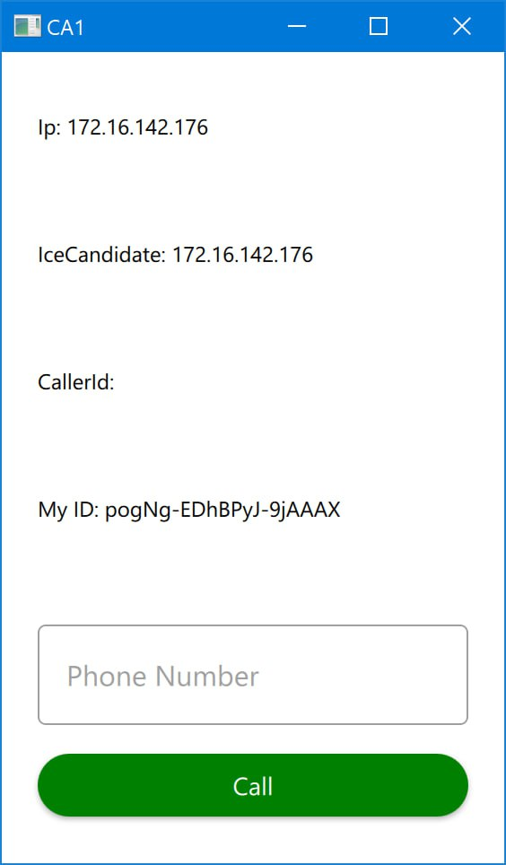
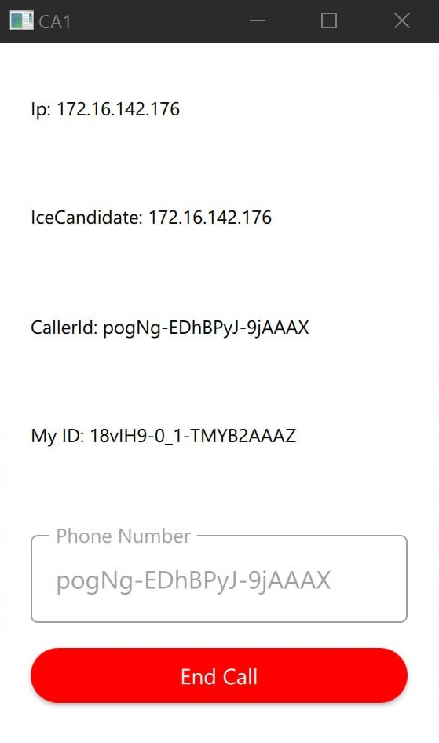
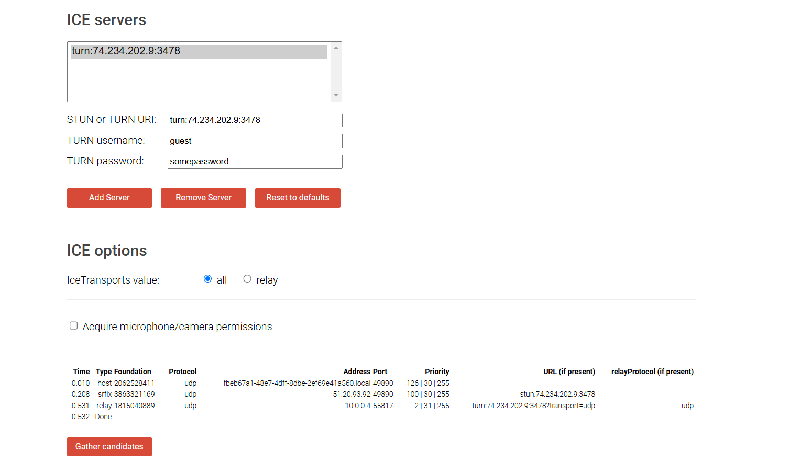
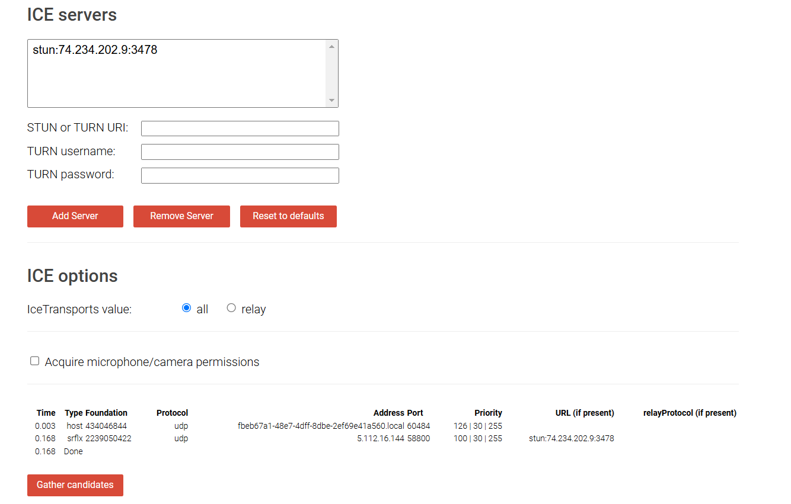

# **Distributed Voice Call**

This application sets up a basic real-time communication interface using QML and C++. It leverages the `WebRTC`, `Client`, `AudioInput`, and `AudioOutput` classes to enable audio communication over TCP, with WebRTC handling signaling. The main QML file provides a user interface for initiating and managing audio calls, while `main.cpp` registers the classes with the QML engine and loads the QML interface.

<p align="center">
  
  &nbsp;&nbsp;&nbsp;&nbsp;&nbsp;&nbsp;&nbsp;&nbsp;
  
</p>

## **Audio Classes**

### Main Challenges of Audio Classes

The main challenge was configuring the correct buffer sizes for encoding and decoding, along with setting the sample rate and format. Initially, we used an 8 kHz sample rate and Float format, which amusingly resulted in robotic-sounding audio. We later adjusted to a 48 kHz sample rate and Int16 format. For encoding and decoding, we set the frame size as `len / 2` (2 accounts for the `opus_int16` size and a single channel) and doubled the decoded bytes to match this division. We also set the buffer size to `sample rate / 20 = 48000 / 2` for a 20 ms audio packet. These adjustments are reflected in the `writeData` method of `AudioInput` and the `play` method of `AudioOutput`.

## **AudioInput Class**

This class inherits from `QIODevice`, an abstract class in Qt that is used for handling device input and output. `QIODevice` provides a uniform interface for reading and writing data, as well as managing various data sources like buffers, files, sockets, etc. In `AudioInput`, we use it to write the data from `QAudioSource` after encoding.

### **Signals**

```cpp
    void audioIsReady(const QByteArray &data);
```

This signal is emitted whenever a new chunk of encoded audio data is available.
 It sends the encoded audio as a QByteArray , which can be easily handled or sent across the network.

### **`Constructor`**

We initialize the audio source with a custom format and set up the encoder. The sample rate for both the encoder and the audio source is set to 48 kHz, as this is commonly supported by most audio hardware (e.g., microphones, sound cards, and my own setup).

```cpp
AudioInput::AudioInput()
{
    int error;
    opusEncoder = opus_encoder_create(48000, 1, OPUS_APPLICATION_AUDIO, &error);
    QAudioFormat format;
    format.setSampleRate(48000);
    format.setChannelCount(1);
    format.setSampleFormat(QAudioFormat::Int16);

    audio = new QAudioSource(format, this);
    ...
}
```

### **`start()`**

This method starts audio capture. To understand the overall process, it's important to know that `QAudioSource` has two `start` methods (overloads). One takes no arguments, and the other takes a pointer to an instance of `QIODevice`. When we use the latter, after capturing the audio, it passes the data to the `writeData` method of the `QIODevice` instance. In this case, since we pass a pointer to `AudioInput`, the captured audio data will be sent to the overridden `writeData` method in our class.

### **`stop()`**

Stops the audio capture and closes the device.

### **`writeData(const char *data, qint64 len)`**

As mentioned in the `start()` method, after capturing the audio, the data is passed to this method. Here, we encode the data using the Opus encoder and then emit the `audioIsReady` signal to send the encoded audio packet.

```cpp
qint64 AudioInput::writeData(const char *data, qint64 len)
{
    std::vector<unsigned char> opusData(960);
    int frameSize = len / 2;
    int encodedBytes = opus_encode(
        //..
        );
    //...
    Q_EMIT audioIsReady(encodedOpusData);
    return len;
}
```

We set the size of `opusData` to 960 because we are working with 20 ms frames. The sample rate (48 kHz) divided by 20 ms gives 960 (48000 / 50 = 960).

According to the Opus documentation, the input length for the `opus_encode` method is equal to `frame_size * channels * sizeof(opus_int16)`. Since the size of `opus_int16` is 2 bytes and we are using 1 channel, the frame size is equal to the length of the input data divided by 2 (`len / 2`).

### **`readData(const char *data, qint64 len)`**

Due to inheriting from `QIODevice`, we must override this method. However, since we don't use it in this class, the implementation simply returns zero and doesn't perform any operation.

## **AudioOutput Class**

This class is responsible for handling audio output functionality. It inherits from `QObject` and uses Qt's audio framework along with the Opus decoder to play audio data. The class manages a queue of audio packets and provides mechanisms for decoding and playing them through the system's audio output device.

### **Signals**

```cpp
    void newPacket();
```

This signal is emitted whenever new audio data is added to the playQueue, triggering the play mechanism.

### Setup Methods

#### **`setupDecoder()`**

Initializes the Opus decoder with a sample rate of 48 kHz and mono channel configuration.

#### **`setupAudio()`**

Configures the audio format and initializes the audio sink.

### Core Functionality

#### **`start()`**

Initializes the audio output device and opens it for writing:

#### `addData(const QByteArray &data)`

Adds new encoded audio data to the playQueue in a thread-safe manner:

```cpp
void AudioOutput::addData(const QByteArray &data){
    mutex.lock();
    playQueue.push(data);
    mutex.unlock();
    Q_EMIT newPacket();
}
```

#### **`play()`**

Decodes and plays the audio data from the queue. This method:

1. Takes the first packet from the queue
2. Decodes it using the Opus decoder
3. Writes the decoded data to the audio device

```cpp
void AudioOutput::play(){
    mutex.lock();
    QByteArray data = playQueue.front();

    std::vector<opus_int16> decodedOutput(960);

    int decodedBytes = opus_decode(decoder,
                                     reinterpret_cast<const unsigned char*>(data.data()),
                                     data.size(),
                                     decodedOutput.data(),
                                     960,
                                     0) * 2;

    const char* outputToWrite = reinterpret_cast<const char*>(decodedOutput.data());

    ioDevice->write(outputToWrite, decodedBytes);
    playQueue.pop();
    mutex.unlock();
}
```

The buffer size of 960 samples corresponds to 20ms of audio at 48 kHz sample rate, matching the same frame size used in the AudioInput class.

### State Management

#### **`handleStateChanged(QAudio::State newState)`**

Monitors the audio system's state changes and handles different states (Idle, Stopped, etc.):

## Server

This code represents a simple WebSocket server using **Socket.IO** to manage real-time communication between clients. We implemented this server using JavaScript.

### Main Challenges

The main challenge in our project was that the ID users want to use to call each other and send SDPs must be unique, and the server must also be aware of it. So, at the beginning of the client's connection with the server, we send a socket ID assigned to the client itself, ensuring it is unique on the server and that the server is aware of it (`io.on('connection', (socket) => { ... })`). In every SDP offer and answer, the client includes this ID for the target client it wants to send the SDP to, so the server can find and send the SDP to the correct recipient. Additionally, along with the SDP, the server sends the sender's ID to the target client, allowing it to identify who sent the SDP.

### Methods

- **`io.on('connection', ...)`**: Handles new client connections and assigns a unique `socket.id`.
- **`handle_sdp_messages()`**: Processes and forwards SDP "offer" and "answer" messages to target clients.
- **`handle_ice_messages()`**: Processes and forwards ICE candidate information to target clients.
- **`socket.on('disconnect', ...)`**: Manages client disconnections and removes them from the `clients` object.

### Events

- **`offer_sdp`**: Event received when a client sends an SDP "offer".
- **`answer_sdp`**: Event received for SDP "answer".
- **`send_ice`**: Event for relaying ICE candidates.
- **`your_id`**: Notifies the client of its unique socket ID.

## Client Class

The `Client` class serves as an interface between the application and the signaling server, facilitating the exchange of Session Description Protocols (SDPs) and ICE candidates necessary for WebRTC-based communication. This class enables the initiation and management of peer-to-peer connections by handling the transmission and reception of SDPs and ICE candidates.

When a user initiates a call, an SDP offer is generated by the `WebRTC` class and sent to the signaling server. The server then forwards this offer to the intended recipient (answerer). The answerer generates an SDP answer and sends it back through the server. Upon receipt of the SDP answer, the connection can be established via WebRTC. Additionally, ICE candidates are exchanged through this class to maintain connectivity.

### Signals

- **`newSdpReceived`**: Emitted when a new SDP is received, containing the `peerID` and the SDP content.
- **`answerIsReadyToGenerate`**: Triggered when an offer SDP is received, indicating that an answer needs to be generated.
- **`localIdIsSet`**: Emitted when the local socket ID is set, providing the `id` and an `isOfferer` flag.
- **`newIceCandidateReceived`**: Emitted when a new ICE candidate is received, containing the `id`, `candidate`, and `mid`.

### Public Slots

- **`void sendIceCandidate`**: Sends an ICE candidate to the specified peer.
- **`void sendOffer`**: Sends an SDP offer to a peer.
- **`void sendAnswer`**: Sends an SDP answer to a peer.

### **`Constructor`**

The `Client` class constructor initializes the connection with the signaling server. Once connected, the server assigns a unique ID to the client, which is used for communication. The class also sets up listeners to handle incoming SDPs and ICE candidates, emitting appropriate signals when data is received.

```cpp
Client::Client(QObject *parent)
    : QObject(parent)
{

    client.socket()->on("your_id", sio::socket::event_listener([this](sio::event &ev) {
                        // Converting data...
                        if (m_mySocketId != data) {
                            //...
                            Q_EMIT localIdIsSet(data, false);
                        }
                        }));

    client.socket()->on("offer_sdp", sio::socket::event_listener([this](sio::event &ev) {
                    // Converting data...
                        if (m_newSdp != sdp) {
                            m_newSdp = sdp;
                            Q_EMIT newSdpReceived(fromClientId, sdp);
                        }
                        Q_EMIT answerIsReadyToGenerate(fromClientId);
                        }));

    client.socket()->on("answer_sdp", sio::socket::event_listener([this](sio::event &ev) {
                        // Converting data...
                                if (m_newSdp != sdp) {
                                    m_newSdp = sdp;
                                    Q_EMIT newSdpReceived(fromClientId, sdp);
                                }
                        }));

    client.socket()->on("send_ice", sio::socket::event_listener([this](sio::event &ev) {
                        // Converting data...
                        Q_EMIT newIceCandidateReceived(fromClientId, candidate, mid);
                        }));

    client.connect("http://74.234.202.9:3000");
}
```

### **`sendOffer(const QString &id, const QString &sdp)`**

Sends an SDP offer to a specified peer.


### **`sendAnswer(const QString &id, const QString &sdp)`**

Sends an SDP answer.

### **`sendIceCandidate(const QString &id, const QString &candidate, const QString &mid)`**

Sends an ICE candidate.

## WebRTC Class

The `WebRTC` class manages WebRTC peer-to-peer connections, allowing for the creation and management of audio data channels between peers. Using the `libdatachannel` library, it handles signaling, ICE candidate exchange, media track setup, and transmission of audio data. Key functionalities include SDP (Session Description Protocol) generation for offer and answer handling, configuration of audio tracks, and management of connection states with peers.

### Main Challenges

The main challenge in this part was sending the ICE candidates. When we sent SDPs immediately after generation without considering the ICE candidate gathering state, an error would occur while setting the remote candidate (sent via the server). So, we decided to send the SDP only when the ICE candidate gathering state is complete. As a result, we won’t send any ICE candidates before the gathering state is complete (We check it using `m_gatheringCompleted` variable).

Another problem was with generating the answer SDP. Initially, we used this:

```cpp
connection->setLocalDescription(rtc::Description::Type::Answer);
```

This caused exceptions and errors. We then found that after setting the offer SDP, WebRTC automatically handles generating answers, so we only need to use this syntax:

```cpp
connection->localDescription()->generateSdp();
```

Another problem was with the audio. The audio input and output were working correctly, but when we connected everything, the received audio was unclear and only produced noise. The issue was that we needed to remove the header (RTPHeader) after receiving it in the `readVariant` method.

```cpp
if (resultData.size())
    resultData.remove(0, sizeof(RtpHeader));
```

### Signals

- **`connectionClosed`**: Emitted when a connection to a peer is closed.
- **`incommingPacket`**: Emitted when a new packet arrives from a peer.
- **`localDescriptionGenerated`**: Signals that a local SDP description is ready.
- **`localCandidateGenerated`**: Signals a generated ICE candidate for a peer.
- **`gatheringCompleted`**, **offerIsReady**, **answerIsReady**: Emit notifications for offer/answer readiness and gathering completion.
- **`ssrcChanged`**, **payloadTypeChanged**, **bitRateChanged**: Notify listeners of changes to SSRC, payload type, and bit rate.
- **`rtcConnected`**: Emitted when a WebRTC connection has successfully been established.

### **`Constructor`**

Initializes a new instance and establishes a connection for the `gatheringCompleted` signal. Once `gatheringCompleted` is emitted, the instance will trigger either the `offerIsReady` or `answerIsReady` signal, depending on the user’s role.

```cpp
    connect(this, &WebRTC::gatheringCompleted, [this] (const QString &peerId) {
        if (!m_gatheringCompleted) return;
        // Sending SDP...
    });
```

### **`init(const QString &id, bool isOfferer = false)`**

Initializes WebRTC settings, including ICE servers and audio configuration.

### **`addPeer(const QString &peerId)`**

Adds a new peer connection and sets up callback functions for handling peer events.

If the ICE Candidates were generated completely we update m_localDescription and m_isOfferer based on new generated local description.

```cpp
    // Set up a callback for when the local description is generated
    newPeer->onLocalDescription([this, peerId](const rtc::Description &description) {
        if (m_gatheringCompleted) return;
        auto typeString = QString::fromStdString(description.typeString());
        auto sdp = QString::fromStdString(description);
        m_isOfferer = (typeString == "offer");
        m_localDescription = descriptionToJson(description);

    });
```

 When an ICE candidate becomes available, the `localCandidateGenerated` signal is emitted, depending on the gathering state. If ICE candidates have already been completely gathered, `localCandidateGenerated` is emitted to send the candidate to the other client via the signaling server.

```cpp
    // Set up a callback for handling local ICE candidates
    newPeer->onLocalCandidate([this, peerId](rtc::Candidate candidate) {
        if (!m_gatheringCompleted) return;
        Q_EMIT localCandidateGenerated(peerId,
                                     QString::fromStdString(candidate.candidate()),
                                     QString::fromStdString(candidate.mid()));
    });
```

Upon a change in connection state, if the new state is "connected," the relevant signal is emitted. If the connection has been closed, connection data is first removed from the maps, `m_gatheringCompleted` is reset, and then the corresponding signal is emitted.

```cpp
    newPeer->onStateChange([this, peerId](rtc::PeerConnection::State state) {
        // Handle different states like New, Connecting, Connected, Disconnected, etc.
        switch (state) {
        // Ignore remaining states
        case rtc::PeerConnection::State::Connected:
            Q_EMIT rtcConnected();
            break;
        case rtc::PeerConnection::State::Closed:
            removeConnectionData(peerId);
            Q_EMIT connectionClosed();
            break;
        default:
            break;
        }
    });
```

Sets up a callback to track the gathering state of the peer connection. When the gathering completes, the gatheringCompleted signal is emitted with the peer ID to indicate readiness for communication.

```cpp
    newPeer->onGatheringStateChange([this, peerId](rtc::PeerConnection::GatheringState state) {
        // When the gathering is complete, emit the gatheringComplited signal
        if (rtc::PeerConnection::GatheringState::Complete == state) {
            m_gatheringCompleted = true;
            Q_EMIT gatheringCompleted(peerId);
        }
    });
```

Sets up a callback to handle incoming media tracks. When a track is received, it is stored in `m_peerTracks` for the specified peer ID. An `onMessage` callback is also included, though it won't be used here since the correct callback will be set in the `addAudioTrack` method. This structure follows the provided template.

```cpp
    newPeer->onTrack([this, peerId](std::shared_ptr<rtc::Track> track) {
        // handle the incoming media stream, emitting the incommingPacket signal if a stream is received
        m_peerTracks[peerId] = track;
        track->onMessage([this, peerId](rtc::message_variant data) {
            qDebug() << "on message called in add peer";
        });
    });
```

### **`generateOfferSDP(const QString &peerId)`** and **`generateAnswerSDP(const QString &peerId)`**

Create and set local offer or answer SDP, setting the offerer role accordingly.

### **`addAudioTrack(const QString &peerId, const QString &trackName)`**

Adds an audio track to the specified peer connection, setting up message handling for audio data. Emits `incommingPacket` when new audio packets are received.

### **`sendTrack(const QString &peerId, const QByteArray &buffer)`**

Sends encoded audio data as RTP packets to a peer.

### **`setRemoteDescription(const QString &peerId, const QString &sdp)`**

Sets remote SDP information for a peer connection.

### **`setRemoteCandidate(const QString &peerId, const QString &candidate, const QString &sdpMid)`**

Adds remote ICE candidates to facilitate NAT traversal.

### **`readVariant(const rtc::message_variant &data)`**

A helper method that reads `rtc::message_variant` data and converts it into a `QByteArray`. After conversion, it removes the `RtpHeader` added when sending data in the `sendTrack` method:

```cpp
    if (!resultData.isEmpty())
        resultData.remove(0, sizeof(RtpHeader));
```

### **`descriptionToJson(const rtc::Description &description)`**

Converts SDP descriptions to JSON format, simplifying SDP handling between peers.

The structure of Json is:

```json
{
    "type": "offer", // or answer
    "sdp":  "<sdp>"
}
```

### **`removeConnectionData(const QString &peerId)`**

Removes peer-specific data when a connection is closed, resetting relevant internal states.

### **`closeConnection(const QString &peerId)`**

This method is responsible for terminating a WebRTC connection associated with a specific peer ID. It checks if the peer ID exists in the `m_peerConnections` map. If it does, it calls the `close()` method on the corresponding connection object, effectively ending the connection. After closing the connection, it invokes the `removeConnectionData` method to clean up any associated data related to that peer ID.

## Main Challenges

The main challenge in bringing all the parts together was interacting with the UI. We needed to call class methods based on UI actions, synchronize with signals from other classes, and retrieve some data from the UI. For class signaling, we could have used `QObject::connect`, but since some UI components needed to be updated and data retrieved based on triggered signals, we used `qmlRegisterType` instead. For example:

```cpp
qmlRegisterType<WebRTC>("Webrtc", 1, 0, "WebRTC");
```

## **`main.cpp`**

The `main.cpp` file creates a `QGuiApplication` instance, registers custom C++ classes for use in QML, and loads the QML user interface.

The following lines register the C++ classes as QML types so they can be accessed in QML:

```cpp
qmlRegisterType<WebRTC>("Webrtc", 1, 0, "WebRTC");
qmlRegisterType<Client>("Client", 1, 0, "Client");
qmlRegisterType<AudioInput>("Audio", 1, 0, "AudioInput");
qmlRegisterType<AudioOutput>("Audio", 1, 0, "AudioOutput");
```

Explanation of each line:

- **`qmlRegisterType<Class>("Module", MajorVersion, MinorVersion, "TypeName")`**:
    - Registers the C++ class (`WebRTC`, `Client`, `AudioInput`, `AudioOutput`) for use in QML.
    - **Module**: Groups related types (e.g., `"Webrtc"`, `"Client"`, `"Audio"`).
    - **Version**: Specifies the module version (`1.0`).
    - **TypeName**: The name used in QML (e.g., `WebRTC`).

## **`main.qml`**

In the QML file, the following components registered in `main.cpp` are used:

```qml
WebRTC {
    id: webrtc
    // Additional properties and logic
}

Client {
    id: client
    // Additional properties and logic
}

AudioOutput {
    id: output
    // Additional properties and logic
}

AudioInput {
    id: input
    // Additional properties and logic
}
```

## Application Flow

To understand the workflow, let's follow the sequence of operations:

1. **Initialization**:

   In the `Client` class, when the program starts, the server sends a unique ID. Upon receiving this ID, the `localIdIsSet` signal is emitted. This triggers the initialization of the `WebRTC` instance and updates the UI.

   ```qml
   onLocalIdIsSet: (id, isOfferer) => {
       webrtc.init(id, isOfferer);
       myIdText.text = "My ID: " + id;
   }
   ```

2. **Initiating a Call**:

    When client A wants to call client B, the ID of client B is entered in the `TextField` component, and the call button is clicked. The `onClicked` handler updates the button state and initiates the call:

   ```qml
   Material.background = "red"
   text = "End Call"
   webrtc.addPeer(textfield.text)
   webrtc.generateOfferSDP(textfield.text)
   ```

   The `generateOfferSDP` method in `WebRTC` emits the `onOfferIsReady` signal when the offer is prepared. This offer is sent to the target client via the signaling server:

   ```qml
   onOfferIsReady: (peerId, description) => client.sendOffer(peerId, description);
   ```

3. **Receiving an Offer**:

   Client B receives the offer through the server. The `Client` class emits the `newSdpReceived` and `answerIsReadyToGenerate` signals, triggering:

   ```qml
   onNewIceCandidateReceived: (id, candidate, mid) => webrtc.setRemoteCandidate(id, candidate, mid)

   onAnswerIsReadyToGenerate: (id) => {
       textfield.text = id;
       webrtc.generateAnswerSDP(id);
   }
   ```

   After generating the answer, the `onAnswerIsReady` signal is emitted, and the answer is sent back via the signaling server:

   ```qml
   onAnswerIsReady: (peerId, description) => client.sendAnswer(peerId, description);
   ```

4. **Establishing the Connection**:

   Once Client A receives the answer, it sets the remote description and waits for the connection to be established. The `rtcConnected` signal is emitted upon successful connection in both clients:

   ```qml
   onRtcConnected: () => {
       callbtn.pushed = true;
       callbtn.Material.background = "red"
       callbtn.text = "End Call"
       input.start();
       output.start();
   }
   ```

5. **Audio Transmission**:

   Audio packets are encoded and sent through tracks using WebRTC. When an audio packet is ready, the `audioIsReady` signal triggers its transmission:

   ```qml
   onAudioIsReady: (data) => webrtc.sendTrack(textfield.text, data);
   ```

   On the receiving side, the `incomingPacket` signal processes the packet, sending the data buffer to `AudioOutput` for playback:

   ```qml
   onIncomingPacket: (id, data, len) => output.addData(data);
   ```

6. **Ending the Call**:

    Clicking the "End Call" button closes the connection, resets the UI, and stops the audio components:

   ```qml
   webrtc.closeConnection(textfield.text);
   ```

   The `connectionClosed` signal is emitted, and the application cleans up accordingly:

   ```qml
   onConnectionClosed: () => {
       input.stop();
       output.stop();
       callbtn.pushed = false;
       callbtn.Material.background = "green"
       callbtn.text = "Call"
   }
   ```

## WebRTC

WebRTC (Web Real-Time Communication) is a technology that enables real-time audio, video, and data sharing between browsers and devices, directly in a peer-to-peer (P2P) manner without needing plugins or additional software.

## Components of WebRTC

### STUN Server (Session Traversal Utilities for NAT)

* **What it does**:
A STUN server helps devices identify their public IP address. This is important because most devices are behind NAT (Network Address Translation), which hides a device's internal IP address on a private network. When two users want to connect via WebRTC, each needs to know its public-facing IP address to connect directly (peer-to-peer).

* **Advantages**:

    * Low Resource Demand: STUN servers don’t require much processing power or bandwidth because they don’t handle the media/data traffic directly.
    * Direct Connection: They help establish a direct connection, 
    which keeps latency low and minimizes server dependency.

* **Disadvantages**:

    * Limited to Simple NATs: STUN works well only for simpler NAT types. For complex NAT configurations or firewalls, STUN alone may not be sufficient to establish a connection.
    * Relies on Open Ports: STUN requires certain ports to be open, and strict network firewalls can block these, making STUN ineffective in some cases.

### TURN Server (Traversal Using Relays around NAT)
* **What it does**:
A TURN server acts as a relay between two devices when a direct connection isn’t possible. If NAT or firewalls block the peer-to-peer connection, both devices send their data to the TURN server, which then relays it between them. This makes TURN essential for ensuring connectivity in cases where STUN alone can’t establish a connection.

* **Advantages**:

    * Guaranteed Connectivity: TURN servers can work even when there are complex NATs or firewalls that would otherwise block a direct peer-to-peer connection.
    * Reliable Fallback: They provide a fallback for situations where direct connections are not possible, increasing WebRTC’s reliability.
* **Disadvantages**:

    *Increased Latency: Since data is relayed through the TURN server rather than going directly between peers, it takes a longer path, which increases latency.
    * Higher Costs: TURN servers consume more resources because they handle the actual media traffic. They require higher bandwidth and server capacity, which can be expensive for large-scale applications.

**What is Coturn?** Coturn is an open-source TURN and STUN server that provides both functionalities in a single package. It’s widely used in WebRTC applications to ensure connectivity between peers, even in challenging network environments.
    
### Signaling Server
* **What it does**:
The signaling server is responsible for exchanging connection information between peers to set up the WebRTC connection. This involves sharing the necessary metadata (such as IP addresses and network ports) and negotiating connection parameters. Importantly, the signaling server is only involved during the setup phase, not during the actual data transmission.

* **Advantages**:

    * Flexibility in Communication: The signaling server doesn’t dictate the communication protocol, meaning developers can use various protocols (like WebSocket, HTTP) based on their needs.
    * Security and Session Management: It can handle user authentication, session management, and secure key exchanges, making the initial connection setup more secure.
* **Disadvantages**:

    * Additional Component: A signaling server is an extra piece of infrastructure to maintain, adding to the complexity of a WebRTC system.
    * Potential Point of Failure: Since all initial connections depend on it, if the signaling server goes down, new connections can’t be established until it’s restored.

## What did we do in this project?
Here’s how we set up a TURN and STUN server on Microsoft Azure using the GitHub Student Pack, making it easy to handle WebRTC connections for peer-to-peer communication. Let me walk you through the setup and what each part of the configuration does.

### 1. Getting the VPS from Microsoft Azure

First, we got a virtual private server (VPS) from Microsoft Azure, thanks to the GitHub Student Pack, which provides free credits for students. Having this cloud server means we get a stable public IP address, perfect for hosting a TURN and STUN server accessible by any client on the internet.

### 2. Installing `coturn` and Setting Up the Config

We chose `coturn` as our TURN/STUN server software—it’s widely used and reliable. After installing it on our Azure VPS, we set up the following configuration to make it work as both a TURN and STUN server. Here’s what the config file looks like and a quick breakdown of what each setting does:

```
# Listening ports for STUN and TURN
listening-port=3478
tls-listening-port=5349

# Enable fingerprinting and long-term credential mechanism
fingerprint
lt-cred-mech

# Set the server name and realm to the server's IP address
server-name=your_public_IP_address
realm=your_public_IP_address

# Create a test user for authentication (replace with secure values in production)
user=guest:somepassword

# Set total relay quota and nonce time
total-quota=100
stale-nonce=600

# Configure log file location (optional)
log-file=/var/log/turnserver.log
simple-log

# Enable relay for TCP and UDP
relay-ip=your_public_IP_address
relay-threads=3
min-port=49152
max-port=65535
```

#### What Each Setting Does

- **Listening Ports**: 
  - `listening-port=3478` and `tls-listening-port=5349` are set to standard ports.

- **Fingerprinting and Credentials**:
  - `fingerprint` adds a digital fingerprint to each packet, making it easier for clients to verify data integrity.
  - `lt-cred-mech` enables long-term credentials, which requires clients to authenticate with a username and password.

- **Server Name and Realm**:
  - `server-name` and `realm` are set to the server’s IP. This way, the server recognizes itself based on its public IP, which is handy during testing.

- **User Authentication**:
  - We created a test user with `user=guest:somepassword`, which lets us test connections. For production, it’s best to use strong, unique passwords.

- **Quota and Security Settings**:
  - `total-quota=100` limits the maximum number of concurrent relay connections to prevent overload.
  - `stale-nonce=600` automatically expires authentication tokens after 10 minutes, which improves security against replay attacks.

- **Logging**:
  - `log-file` logs activity to `/var/log/turnserver.log`, while `simple-log` keeps the log entries concise and easier to read.

- **Relay for TCP and UDP**:
  - `relay-ip` is the public IP, and `relay-threads=3` lets the server handle relays on multiple threads.
  - The port range defined by `min-port` and `max-port` specifies where relayed connections will occur, reducing conflicts with other services.

### 3. Testing the STUN and TURN Server

To check if our setup works, we used [WebRTC’s Trickle ICE tool](https://webrtc.github.io/samples/src/content/peerconnection/trickle-ice/). This tool tests the connection and shows the different ICE candidates that the server generates for both STUN and TURN. Everything worked as expected—no errors, and our server responded correctly.

<p align="center">
  <div style="border: 2px solid #ddd; padding: 10px; display: inline-block;">
    
    <p style="font-weight: bold; text-align: center; margin-top: 5px;">TURN Server</p>
  </div>
  <br><br>
  <div style="border: 2px solid #ddd; padding: 10px; display: inline-block;">
    
    <p style="font-weight: bold; text-align: center; margin-top: 5px;">STUN Server</p>
  </div>
</p>

### 4. Adding the Signaling Server

Next, we needed a signaling server to coordinate the initial connection between peers. We added our signaling server code (written in JavaScript) to the VPS and used `pm2` to manage it. `pm2` is great because it keeps the server running in the background and can restart it automatically if it crashes. Now the signaling server is always on and ready to help establish WebRTC connections.

### Final Result

With both the TURN/STUN and signaling servers on the VPS, everything is set up. Now our WebRTC app can connect directly, without any extra setup or local dependencies. This setup is fully hosted on the server, so users can easily connect peer-to-peer even behind firewalls or NATs, thanks to the TURN server relaying the data when needed. 

