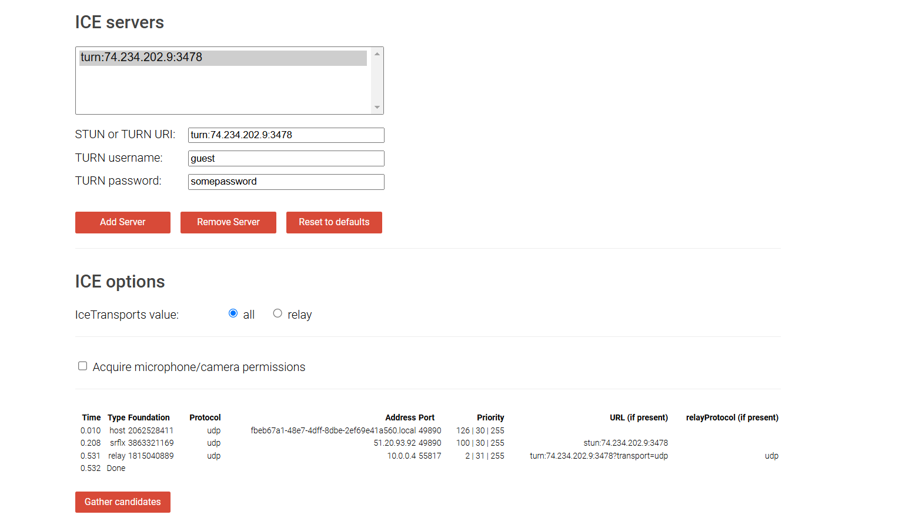

## WebRTC

WebRTC (Web Real-Time Communication) is a technology that enables real-time audio, video, and data sharing between browsers and devices, directly in a peer-to-peer (P2P) manner without needing plugins or additional software.

## Components of WebRTC

### STUN Server (Session Traversal Utilities for NAT)

* **What it does**:
A STUN server helps devices identify their public IP address. This is important because most devices are behind NAT (Network Address Translation), which hides a device's internal IP address on a private network. When two users want to connect via WebRTC, each needs to know its public-facing IP address to connect directly (peer-to-peer).

* **Advantages**:

    * Low Resource Demand: STUN servers don’t require much processing power or bandwidth because they don’t handle the media/data traffic directly.
    * Direct Connection: They help establish a direct connection, 
    which keeps latency low and minimizes server dependency.

* **Disadvantages**:

    * Limited to Simple NATs: STUN works well only for simpler NAT types. For complex NAT configurations or firewalls, STUN alone may not be sufficient to establish a connection.
    * Relies on Open Ports: STUN requires certain ports to be open, and strict network firewalls can block these, making STUN ineffective in some cases.

### TURN Server (Traversal Using Relays around NAT)
* **What it does**:
A TURN server acts as a relay between two devices when a direct connection isn’t possible. If NAT or firewalls block the peer-to-peer connection, both devices send their data to the TURN server, which then relays it between them. This makes TURN essential for ensuring connectivity in cases where STUN alone can’t establish a connection.

* **Advantages**:

    * Guaranteed Connectivity: TURN servers can work even when there are complex NATs or firewalls that would otherwise block a direct peer-to-peer connection.
    * Reliable Fallback: They provide a fallback for situations where direct connections are not possible, increasing WebRTC’s reliability.
* **Disadvantages**:

    *Increased Latency: Since data is relayed through the TURN server rather than going directly between peers, it takes a longer path, which increases latency.
    * Higher Costs: TURN servers consume more resources because they handle the actual media traffic. They require higher bandwidth and server capacity, which can be expensive for large-scale applications.

**What is Coturn?** Coturn is an open-source TURN and STUN server that provides both functionalities in a single package. It’s widely used in WebRTC applications to ensure connectivity between peers, even in challenging network environments.
    
### Signaling Server
* **What it does**:
The signaling server is responsible for exchanging connection information between peers to set up the WebRTC connection. This involves sharing the necessary metadata (such as IP addresses and network ports) and negotiating connection parameters. Importantly, the signaling server is only involved during the setup phase, not during the actual data transmission.

* **Advantages**:

    * Flexibility in Communication: The signaling server doesn’t dictate the communication protocol, meaning developers can use various protocols (like WebSocket, HTTP) based on their needs.
    * Security and Session Management: It can handle user authentication, session management, and secure key exchanges, making the initial connection setup more secure.
* **Disadvantages**:

    * Additional Component: A signaling server is an extra piece of infrastructure to maintain, adding to the complexity of a WebRTC system.
    * Potential Point of Failure: Since all initial connections depend on it, if the signaling server goes down, new connections can’t be established until it’s restored.

## What did we do in this project?
Here’s how we set up a TURN and STUN server on Microsoft Azure using the GitHub Student Pack, making it easy to handle WebRTC connections for peer-to-peer communication. Let me walk you through the setup and what each part of the configuration does.

### 1. Getting the VPS from Microsoft Azure

First, we got a virtual private server (VPS) from Microsoft Azure, thanks to the GitHub Student Pack, which provides free credits for students. Having this cloud server means we get a stable public IP address, perfect for hosting a TURN and STUN server accessible by any client on the internet.

### 2. Installing `coturn` and Setting Up the Config

We chose `coturn` as our TURN/STUN server software—it’s widely used and reliable. After installing it on our Azure VPS, we set up the following configuration to make it work as both a TURN and STUN server. Here’s what the config file looks like and a quick breakdown of what each setting does:

```
# Listening ports for STUN and TURN
listening-port=3478
tls-listening-port=5349

# Enable fingerprinting and long-term credential mechanism
fingerprint
lt-cred-mech

# Set the server name and realm to the server's IP address
server-name=your_public_IP_address
realm=your_public_IP_address

# Create a test user for authentication (replace with secure values in production)
user=guest:somepassword

# Set total relay quota and nonce time
total-quota=100
stale-nonce=600

# Configure log file location (optional)
log-file=/var/log/turnserver.log
simple-log

# Enable relay for TCP and UDP
relay-ip=your_public_IP_address
relay-threads=3
min-port=49152
max-port=65535
```

#### What Each Setting Does

- **Listening Ports**: 
  - `listening-port=3478` and `tls-listening-port=5349` are set to standard ports.

- **Fingerprinting and Credentials**:
  - `fingerprint` adds a digital fingerprint to each packet, making it easier for clients to verify data integrity.
  - `lt-cred-mech` enables long-term credentials, which requires clients to authenticate with a username and password.

- **Server Name and Realm**:
  - `server-name` and `realm` are set to the server’s IP. This way, the server recognizes itself based on its public IP, which is handy during testing.

- **User Authentication**:
  - We created a test user with `user=guest:somepassword`, which lets us test connections. For production, it’s best to use strong, unique passwords.

- **Quota and Security Settings**:
  - `total-quota=100` limits the maximum number of concurrent relay connections to prevent overload.
  - `stale-nonce=600` automatically expires authentication tokens after 10 minutes, which improves security against replay attacks.

- **Logging**:
  - `log-file` logs activity to `/var/log/turnserver.log`, while `simple-log` keeps the log entries concise and easier to read.

- **Relay for TCP and UDP**:
  - `relay-ip` is the public IP, and `relay-threads=3` lets the server handle relays on multiple threads.
  - The port range defined by `min-port` and `max-port` specifies where relayed connections will occur, reducing conflicts with other services.

### 3. Testing the STUN and TURN Server

To check if our setup works, we used [WebRTC’s Trickle ICE tool](https://webrtc.github.io/samples/src/content/peerconnection/trickle-ice/). This tool tests the connection and shows the different ICE candidates that the server generates for both STUN and TURN. Everything worked as expected—no errors, and our server responded correctly.

<p align="center">
  <div style="border: 2px solid #ddd; padding: 10px; display: inline-block;">
    
    <p style="font-weight: bold; text-align: center; margin-top: 5px;">TURN Server</p>
  </div>
  <br><br>
  <div style="border: 2px solid #ddd; padding: 10px; display: inline-block;">
    
    <p style="font-weight: bold; text-align: center; margin-top: 5px;">STUN Server</p>
  </div>
</p>

### 4. Adding the Signaling Server

Next, we needed a signaling server to coordinate the initial connection between peers. We added our signaling server code (written in JavaScript) to the VPS and used `pm2` to manage it. `pm2` is great because it keeps the server running in the background and can restart it automatically if it crashes. Now the signaling server is always on and ready to help establish WebRTC connections.

### Final Result

With both the TURN/STUN and signaling servers on the VPS, everything is set up. Now our WebRTC app can connect directly, without any extra setup or local dependencies. This setup is fully hosted on the server, so users can easily connect peer-to-peer even behind firewalls or NATs, thanks to the TURN server relaying the data when needed. 


